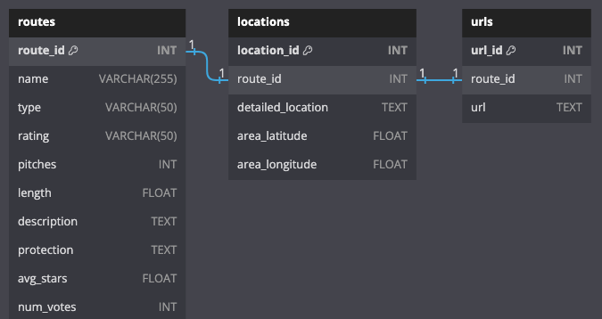

# Mountain Project Climbing Database

## Overview
This PostgreSQL database is designed for educational purposes to demonstrate the construction and management of SQL databases. It contains data sourced from Mountain Project, focusing on climbing routes, locations, and associated information. It provides a practical example of how to structure and populate a relational database with real-world data.

## Database Structure
The database consists of several tables designed to store diverse aspects of climbing data:

1. **Routes Table (Primary)**
   - *Columns:* `Route ID` (primary key), `Route Name`, `Route Type`, `Rating`, `Pitches`, `Length`, `Description`, `Protection`, `Average Stars`, `Number of Votes`.
   - *Description:* Each entry represents a unique climbing route with details like type, rating, and description.

2. **Locations Table**
   - *Columns:* `Location ID` (primary key), `Route ID` (foreign key), `Detailed Location`, `Area Latitude`, `Area Longitude`.
   - *Description:* Provides geographical information for each climbing route.

3. **URLs Table**
   - *Columns:* `URL ID` (primary key), `Route ID` (foreign key), `URL`.
   - *Description:* Contains URLs for additional information related to each climbing route.

## Setup and Usage
1. **Dependencies**
   - Python with libraries: `psycopg2`, `pandas`.
   - PostgreSQL server.

2. **Database Connection**
   - Use `psycopg2` to connect to PostgreSQL.
   - Details for connecting to the database (such as dbname, user, password, host, and port) should be customized as per your local or server settings.

3. **Database Initialization**
   - Execute the provided scripts to create and set up the database with the necessary tables and relations.

4. **Data Population**
   - The database can be populated with data from Mountain Project using custom scripts or manual entry.

## Disclaimer
This project is for educational purposes only and is not affiliated with or endorsed by Mountain Project. To respect the wishes of Mountain Project, the dataset is not being made publicly available, and the database remains private.